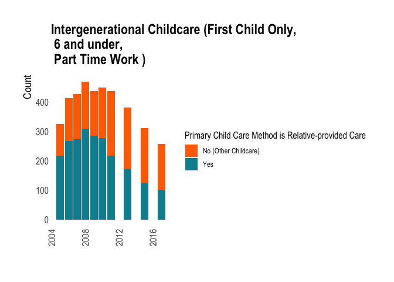

This r markdown file (also rendered as R and md files) includes exploratory analysis work completed for NLSY1997. This includes additional preprocessing and cleaning steps to make variables easier to understand, as well as initial descriptive statistics of distribution and data missingness.

*Note that some results were adapted from work completed in Time Series Labs using the data that I downloaded, cleaned, and processed.* 
## Summary of Columns 
Currently, my selected dataset is the **NLSY97**. The following are some relevant columns in the data set:  


<div data-pagedtable="false">
  <script data-pagedtable-source type="application/json">
{"columns":[{"label":[""],"name":["_rn_"],"type":[""],"align":["left"]},{"label":["vars"],"name":[1],"type":["int"],"align":["right"]},{"label":["n"],"name":[2],"type":["dbl"],"align":["right"]},{"label":["mean"],"name":[3],"type":["dbl"],"align":["right"]},{"label":["sd"],"name":[4],"type":["dbl"],"align":["right"]},{"label":["median"],"name":[5],"type":["dbl"],"align":["right"]},{"label":["trimmed"],"name":[6],"type":["dbl"],"align":["right"]},{"label":["mad"],"name":[7],"type":["dbl"],"align":["right"]},{"label":["min"],"name":[8],"type":["dbl"],"align":["right"]},{"label":["max"],"name":[9],"type":["dbl"],"align":["right"]},{"label":["range"],"name":[10],"type":["dbl"],"align":["right"]},{"label":["skew"],"name":[11],"type":["dbl"],"align":["right"]},{"label":["kurtosis"],"name":[12],"type":["dbl"],"align":["right"]},{"label":["se"],"name":[13],"type":["dbl"],"align":["right"]}],"data":[{"1":"1","2":"2520","3":"3.117723e+04","4":"2.577724e+04","5":"26925","6":"2.758918e+04","7":"17680.0050","8":"200","9":"235884","10":"235684","11":"3.1644507","12":"17.4579964","13":"5.134950e+02","_rn_":"INCOME"},{"1":"2","2":"2511","3":"6.495420e-01","4":"4.772084e-01","5":"1","6":"6.869089e-01","7":"0.0000","8":"0","9":"1","10":"1","11":"-0.6264871","12":"-1.6081539","13":"9.523240e-03","_rn_":"MARRIED_OR_COHABITATING"},{"1":"3","2":"2520","3":"3.797619e-01","4":"4.854238e-01","5":"0","6":"3.497024e-01","7":"0.0000","8":"0","9":"1","10":"1","11":"0.4951977","12":"-1.7554754","13":"9.669874e-03","_rn_":"BA_ABOVE"},{"1":"4","2":"2520","3":"2.492601e+04","4":"3.113608e+04","5":"20000","6":"1.986152e+04","7":"29652.0000","8":"0","9":"283919","10":"283919","11":"2.2630942","12":"10.0060290","13":"6.202455e+02","_rn_":"SPOUSAL_INCOME"},{"1":"5","2":"2520","3":"2.527381e+01","4":"3.868269e+00","5":"25","6":"2.504216e+01","7":"4.4478","8":"16","9":"38","10":"22","11":"0.4896595","12":"-0.3802452","13":"7.705777e-02","_rn_":"MOTHER_AGE_FIRST_CHILD"},{"1":"6","2":"2520","3":"2.752619e+01","4":"3.556177e+00","5":"27","6":"2.731101e+01","7":"2.9652","8":"21","9":"37","10":"16","11":"0.5088563","12":"-0.3818356","13":"7.084074e-02","_rn_":"MATERNAL_AGE"},{"1":"7","2":"309","3":"7.055016e-01","4":"4.565563e-01","5":"1","6":"7.550201e-01","7":"0.0000","8":"0","9":"1","10":"1","11":"-0.8973113","12":"-1.1986803","13":"2.597258e-02","_rn_":"YCCAL-6800"},{"1":"8","2":"2520","3":"5.833333e-01","4":"4.931045e-01","5":"1","6":"6.041667e-01","7":"0.0000","8":"0","9":"1","10":"1","11":"-0.3378605","12":"-1.8865985","13":"9.822877e-03","_rn_":"FAMILY_CARE"},{"1":"9","2":"2520","3":"1.000000e+00","4":"0.000000e+00","5":"1","6":"1.000000e+00","7":"0.0000","8":"1","9":"1","10":"0","11":"NaN","12":"NaN","13":"0.000000e+00","_rn_":"N_CHILDREN"},{"1":"10","2":"2520","3":"8.753968e-01","4":"3.303340e-01","5":"1","6":"9.692460e-01","7":"0.0000","8":"0","9":"1","10":"1","11":"-2.2719302","12":"3.1629227","13":"6.580410e-03","_rn_":"FULL_TIME"},{"1":"11","2":"309","3":"1.705502e+00","4":"4.565563e-01","5":"2","6":"1.755020e+00","7":"0.0000","8":"1","9":"2","10":"1","11":"-0.8973113","12":"-1.1986803","13":"2.597258e-02","_rn_":"Relative_within_15_minutes*"}],"options":{"columns":{"min":{},"max":[10]},"rows":{"min":[10],"max":[10]},"pages":{}}}
  </script>
</div>

| Variable Name  | Variable Text | Values  |
| --- | --- | --- |
| PUBID_1997 | Unique Identifier  |  |
| KEY_SEX_1997 | Sex in 1997  | 1 = Male<br/>2 = Female |
| KEY_RACE_ETHNICITY_1997 | Race/Ethnicity 1997  |  |
| KEY_BDATE_M_1997 | Birthday Month | 1-12 |
| KEY_BDATE_Y_1997 | Birthday YEAR  |  |
| CV_SAMPLE_TYPE_1997 | Cross Section / Oversample | 1 = Cross Sectional<br/> 0 = Oversample |
| KEY_RACE_ETHNICITY_1997 | Race / Ethnicity  | 1 = Black<br/>2 = Hispanic<br/>3 =  Mixed Race<br/>4 = Non Black Non Hispanic  |
| YINC-1400  | Any Income Earned this YEAR? (Binary)  | 0 = No 1 = Yes |
| YINC-1700 | Income (Continuous) | 0-999999+ |
| YINC-2600 | Spouse's Income (Continuous) | 0-999999+ |
| CV_INCOME_FAMILY | Gross Family Income in previous year | 0-999999+ |
| BIOCHILD_BDATE.01~Y | Birthdate (Year) of First Child | 1997 - 2019 | 
| P2-001 | Was Parent 1 Born in US  | 0 - 1  |
| CV_CITIZENSHIP | U.S. citizenship status based on place of birth. | 1 = Yes, 2= No, 3 = No Response |
| MAR_STATUS.01_XRND - MAR_STATUS.12_XRND | Marital Status Jan - Dec of Survey YEAR  | 0 = Never Married, Not Cohabitating <br/> 1 = Never Married, Cohabiting<br/> 2 = Married<br/> 3 = Legally Separated <br/> 4 = Divorced<br/> 5 = Widowed |
| CV_BIO_CHILD_HH | Number of Biological Children RESIDING in the Household (Note: Rs without any biological children are assigned a valid skip (-4).) | 0 - 10+ |
| CV_HH_UNDER_6 | Number of Childen in R’s household under 6  | 0 - 10+ |
| CV_BIO_CHILD_NR | Number of Biological Children NOT RESIDING in the Household (Note: Rs without any biological children are assigned a valid skip (-4).) | 0 - 10+ |
| CV_ENROLLSTAT / CV_ENROLLSTAT_EDT | Enrolled in School?  | 1  = Not enrolled, no high school degree, no GED<br/> 2  = Not enrolled, GED<br/> 3  = Not enrolled, high school degree<br/>4  = Not enrolled, some college<br/> 5  = Not enrolled, 2-YEAR college graduate<br/> 6  = Not enrolled, 4-YEAR college graduate<br/> 7  = Not enrolled, graduate degree<br/> 8  = Enrolled in grades 1-12, not a high school graduate<br/> 9  = Enrolled in a 2-YEAR college<br/> 10 = Enrolled in a 4-YEAR college<br/> 11 = Enrolled in a graduate program |
| CV_HGC_EVER_EDT | Highest ever enrollment  | 0 = NONE<br/>1 = 1ST GRADE<br/>2 = 2ND GRADE<br/>3 = 3RD GRADE<br/>4 = 4TH GRADE<br/>5 = 5TH GRADE<br/>6 = 6TH GRADE<br/>7 = 7TH GRADE<br/>8 = 8TH GRADE<br/>9 = 9TH GRADE<br/>10 = 10TH GRADE<br/>11 = 11TH GRADE<br/>12 = 12TH GRADE<br/>13 = 1ST YEAR COLLEGE<br/>14 = 2ND YEAR COLLEGE<br/>15 = 3RD YEAR COLLEGE<br/>16 = 4TH YEAR COLLEGE<br/>17 = 5TH YEAR COLLEGE<br/>18 = 6TH YEAR COLLEGE<br/>19 = 7TH YEAR COLLEGE<br/>20 = 8TH YEAR COLLEGE OR MORE|
| YCCA-450/YCCAL-450 | AVERAGE HOURS PER WEEK R SPENDS AT WORK, SCHOOL, TRAINING IN PAST 12 MOS (CCA) | 0-999999+ |
| YCCA-6800 | ANY RELATIVES LIVE WITHIN 15 MINUTES OF CHILD'S HOME | 0 - 1  |
| YCCA-1100.01 - 05 | PRIMARY CHILD CARE ARRANGEMENT, CHILD 01-05 | 1 = Spousal or Partner Care<br/> 2 = Relative Care<br/> 3 = Sibling Care<br/> 4 = Self-Care<br/>5 = Non-relative Care<br/> 6 = Family Day Care<br/> 7 = Child Care Center<br/> 8 = Formal Schooling |
| YCCA-1000.01 - 05 | SECONDARY CHILD CARE ARRANGEMENT, CHILD 01-05 | 1 = Spousal or Partner Care<br/> 2 = Relative Care<br/>3 = Sibling Care<br/> 4 = Self-Care<br/> 5 = Non-relative Care<br/> 6 = Family Day Care<br/> 7 = Child Care Center
8 = Formal Schooling |
| YCCAL-1100A.0\*~00000& | \* → number of child <br/> \& → Question Number  |  |
| YCCA-6150.01-05 | Time Unit someone pays for childcare  | 1 = Per Hour<br/> 2 = Per Day<br/> 3 = Per Week |
| YCCAL-4500.0X.06 | WHO TOOK CHILD 0X TO AND FROM FAMILY DAY CARE |  |
| YHHI-55701 | WAS R BORN IN U.S., ITS TERRITORIES OR PUERTO RICO |  |
| YHHI-55704 | WHAT IS R'S CITIZENSHIP STATUS |  |
| YHHI-55705A | HOW OLD WAS R WHEN FIRST CAME TO U.S. FOR 6 MONTHS OR MORE |  |
| YCCAL-6900 | # OF RELATIVES LIVE WITHIN 15 MINUTES OF CHILD'S HOME | 0-10 |
| YCCAL-7100 | ANY RELATIVES W/IN 15 MIN ABLE TO CARE FOR CHILD REGULARLY WITH NO PAYMENT | 0-1 |
| YCCAL-4500.02.05 | WHO TOOK CHILD 0X TO AND FROM FAMILY DAY CARE  | 1 = Respondent<br/> 2 = Child's father<br/> 3 = Equal split between R and child's father<br/> 4 = Respondent's spouse, partner (who is NOT child's father)<br/> 5 = This relative<br/> 6 = Other (SPECIFY)<br/> 999 = UNCODABLE |
| YCCAL-7300 | ANY RELATIVES LIVE WITHIN 15-45 MINUTES OF CHILD'S HOME |  |
| YCCAL-7400 | # OF RELATIVES LIVE WITHIN 15-45 MINUTES OF CHILD'S HOME |  |
| YCCAL-9100 | # OF RELATIVES W/IN 15 MINS OF R'S HOME, R HAS NO CHILDREN |  |
| YCCAL-9000 | DOES R HAVE RELATIVE THAT LIVE W/IN 15 MINUTES, R HAS NO CHILDREN |  |
| YCCAL-9200 | R HAVE RELATIVE W/IN 15 MINS ABLE CARE FOR CHILD REGULARLY, R HAS NO KIDS | 0-1  |
| YCCAL-9300 | ANY RELATIVES THAT LIVE BETWEEN 15-45 MINUTES OF R'S HOME, R HAS NO KIDS | 0-1 |

Note that not all of these columns were ultimately used for this project. Of the existent columns, some of the following steps were completed to reformat the data further for use in regression models:  

* I filtered for women (KEY_SEX_1997 == 2) with at least a High School Education (CV_HGC_EVER_EDT>=12), Part-Time Work (YCCAL-450/YCCA-450 >= 20 and `YINC-1700` or INCOME > 0 )  
* Per Steve McKlaskie from the NLS User Services, "in survey years 2005, 2008, 2011, and 2015 (rnds 9, 12, 15 and 17), the YCCAL questions were added and limited to females born in 1983 and 1984. The older females (born 1980, 1981, 1982) go through the YCCA questions. So, in these rounds your will need to look at both YCCA-1100A and YCCAL-1100A, which are limited to children under the age of 7." Thus, the following were the preprocessing steps for childcare options.  
  - Where YCCAL-1100 observation was NA, I imputed YCCA-1100. Same was done with YCCAL-6800 and YCCA-6800.
  - For consistency across YCCA-110 and YCCAL-1100 (and because these are the years most relevant for my research) I filtered for people with children under 50 in their households. 
  - For models looking at mothers not working / needing childcare at all, I treated YCCAL-450/YCCA-450 == 0 as 'Maternal Childcare' (because these observations indicate the mother takes the child everywhere and thus is the primary 'child care' source. 
  - I dropped observations indicating 'self-care' as the primary childcare sources. 
  - I categorized 'Relative Care' to include 'Relative Care' and 'Family Day Care'. Where I run models with more than one child, I also include sibling care in this definition. 
  - While 'Informal Childcare' includes 'Family Day Care' and 'Non-relative care', 'Formal Childcare' includes Child Care Center and Formal Schooling
  - YCCA-110 and YCCAL-1100 included records for each child that respondents had or models with multiple children, I coded 1 if any childcare option for any of the children is responded to as 'Yes.' (e.g., Spousal Care for child 2 and not child 1 is coded as '1' for Spousal Care).
* I recoded several categorical variables as binary for simplicity when possible  
  - MARRIED_OR_COHABITATING - adapted from Marital Status Variable at the end of the survey year (MAR_STATUS.12_XRND). I coded only 'Married' or 'Not Married, Cohabitating' (1 = Never Married, Cohabiting; 2 = Married) as '1' ("Married/Cohabitating"); other categories (e.g., Widowed, Divorced, Never Married) were coded as '0' ("Not Married")  
  - CV_CITIZENSHIP - '2' is recoded as '0' as it means 'not a citizen'  
  - BA_ABOVE - Highest Education Attainment (CV_HGC_EDT) variable recoded such that anything over 4 Years of College (16) is coded as '1'.  
* I am coding the childcare variables as the case where any of the respondent's children are receiving childcare and are under 6 years of age.  
* Income Variables are imputed for NA's (taken as 0).  
* MATERNAL_AGE variable is created by subtracting the respondent's first child's birthday (FIRST_CHILD_BDATE) from the respondent's birthday (KEY_BDATE_Y_1997).   


### Independent and Dependent Variables

#### Dependent Variables 
* INCOME - Income generated by respondent (Mother)

#### Independent Variables
* FAMILY_CARE - Childcare from Relative, Family Daycare (i.e., dropping child off with family), Sibling Care 
* Relative_within_15_minutes - Does a relative live within 15 minutes of the respondent? 

#### Other Controls
* BA+ - Level of Education 
* N_CHILDREN - Number of children in household total (Not Applicable for models with only first child)
* MARRIED_OR_COHABITATING 
* MATERNAL_AGE 
* SPOUSAL_INCOME

## Descriptive Statistics

### Basic Descriptives

The following is a descriptive statistics table of all of the selected variables, used to look at the ranges of questions and validate my understanding about variable filtering and recoding. *note that at this point some variables such as P2-001 are NaN due to spreading characteristics across years; however, we are not currently planning to use those variables for our models, thus will disregard such variables.* 

<div data-pagedtable="false">
  <script data-pagedtable-source type="application/json">
{"columns":[{"label":[""],"name":["_rn_"],"type":[""],"align":["left"]},{"label":["vars"],"name":[1],"type":["int"],"align":["right"]},{"label":["n"],"name":[2],"type":["dbl"],"align":["right"]},{"label":["mean"],"name":[3],"type":["dbl"],"align":["right"]},{"label":["sd"],"name":[4],"type":["dbl"],"align":["right"]},{"label":["median"],"name":[5],"type":["dbl"],"align":["right"]},{"label":["trimmed"],"name":[6],"type":["dbl"],"align":["right"]},{"label":["mad"],"name":[7],"type":["dbl"],"align":["right"]},{"label":["min"],"name":[8],"type":["dbl"],"align":["right"]},{"label":["max"],"name":[9],"type":["dbl"],"align":["right"]},{"label":["range"],"name":[10],"type":["dbl"],"align":["right"]},{"label":["skew"],"name":[11],"type":["dbl"],"align":["right"]},{"label":["kurtosis"],"name":[12],"type":["dbl"],"align":["right"]},{"label":["se"],"name":[13],"type":["dbl"],"align":["right"]}],"data":[{"1":"1","2":"37476","3":"1.865656e+04","4":"2.225722e+04","5":"12000","6":"1.496814e+04","7":"17791.2000","8":"0","9":"235884","10":"235884","11":"2.7326443","12":"15.0174791","13":"1.149726e+02","_rn_":"INCOME"},{"1":"2","2":"14446","3":"3.981725e-01","4":"4.895383e-01","5":"0","6":"3.727288e-01","7":"0.0000","8":"0","9":"1","10":"1","11":"0.4159856","12":"-1.8270824","13":"4.072986e-03","_rn_":"FAMILY_CARE"},{"1":"3","2":"1490","3":"7.026846e-01","4":"4.572300e-01","5":"1","6":"7.533557e-01","7":"0.0000","8":"0","9":"1","10":"1","11":"-0.8859809","12":"-1.2158524","13":"1.184518e-02","_rn_":"YCCAL-6800"},{"1":"4","2":"43808","3":"2.874361e-01","4":"4.525718e-01","5":"0","6":"2.343072e-01","7":"0.0000","8":"0","9":"1","10":"1","11":"0.9393385","12":"-1.1176688","13":"2.162274e-03","_rn_":"BA_ABOVE"},{"1":"5","2":"43808","3":"7.328342e-01","4":"1.056695e+00","5":"0","6":"5.366355e-01","7":"0.0000","8":"0","9":"8","10":"8","11":"1.5109587","12":"2.1470753","13":"5.048623e-03","_rn_":"N_CHILDREN"},{"1":"6","2":"43587","3":"4.283846e-01","4":"4.948503e-01","5":"0","6":"4.104844e-01","7":"0.0000","8":"0","9":"1","10":"1","11":"0.2894360","12":"-1.9162708","13":"2.370257e-03","_rn_":"MARRIED_OR_COHABITATING"},{"1":"7","2":"43808","3":"1.353734e+04","4":"2.858880e+04","5":"0","6":"6.901675e+03","7":"0.0000","8":"0","9":"340000","10":"340000","11":"3.7072923","12":"21.4156503","13":"1.365901e+02","_rn_":"SPOUSAL_INCOME"},{"1":"8","2":"43808","3":"2.556494e+01","4":"4.954264e+00","5":"25","6":"2.530775e+01","7":"5.9304","8":"15","9":"37","10":"22","11":"0.3714686","12":"-0.7800886","13":"2.367023e-02","_rn_":"MATERNAL_AGE"}],"options":{"columns":{"min":{},"max":[10]},"rows":{"min":[10],"max":[10]},"pages":{}}}
  </script>
</div>

## Data Completeness and Sample Size  
First, I looked at the count and distribution of valid responses, as well as the count of responses of "Yes" within our dataset over time. For the sake of these analyses, I filtered for years after 2005 (as prior to this, many respondents may not have graduated from university). 

### Valid Family Provided Childcare
#### Any Children 6 and under - Any work from respondent)
In the figure below, I filtered for women with at least one child, generating >$0 in income though I also included mothers indicating 0 hours at work or at school without their child. I made the latter decision to see what proportion of our survey could possibly be working from home and/or potentially attempting to work with children at all times. 

Note that for many later models, I will be focusing many models on the childcare options for the first child, and the time period when this child is 0-6 years of age. For such models, we would be ignoring the childcare options provided for the later children in the same time span. 

Below, we see that when filtering for women with at least one child generating any income, there seems to be a relatively even split for relative-provided and other forms of childcare. Within this grouping, there are fewer mothers who are generating any income without being without their child. Also, note that predictably, at younger ages, we do see a higher proportion of mothers with relative care. Per the BLS, the YCCAL (the version of the survey issued to slightly younger respondents) version of the childcare question was issued in 2008, 2011,2015,and 2018; as you can see, these years as well as earlier years (e.g., 2005) seem to have higher proportion of relative-provided care. 


```r
load("~/QMSS/Intergenerational_Childcare_Maternal_Wage_Gap/data/NLSY_imputed_first_child.RData")
NLSY_Valid_Childcare_1 <- Valid_Childcare(NLSY_imputed,TRUE)
NLSY_imputed <- NLSY_imputed[!is.na(NLSY_imputed$WORK_EDU_HRS),]

# This is just with everyone with any biological children in the household; it appears here that we don't have a lot of present data.
p1 <- NLSY_imputed %>% dplyr::select(PUBID_1997,YEAR,BIOCHILD_6_YR,INCOME,`YCCAL-1100A~000002`,`YCCA-1100A~000002`,`FAMILY_CARE`,`RELATIVE_CARE`,WORK_EDU_HRS,CV_BIO_CHILD_HH) %>% subset(YEAR>=2005) %>% subset(INCOME>0)  %>% subset(CV_BIO_CHILD_HH>0) %>% plyr::mutate(FAMILY_CARE_CAT = ifelse(`WORK_EDU_HRS`==0, 'No (Mother Provides Childcare)',ifelse(`FAMILY_CARE`==1,'Yes',ifelse(FAMILY_CARE==0,'No (Other Childcare)',NaN)))) %>% dplyr::group_by(YEAR,FAMILY_CARE_CAT) %>% dplyr::mutate(FAMILY_CARE_CAT_proportion = n()) %>% ungroup() %>% dplyr::group_by(YEAR,FAMILY_CARE_CAT, FAMILY_CARE_CAT_proportion) %>% dplyr::summarize() %>% 
  ggplot(aes(x = YEAR, y = FAMILY_CARE_CAT_proportion)) +
  geom_bar(stat="identity",aes(fill = FAMILY_CARE_CAT)) +
  theme_ipsum(base_size = 12, axis_title_size = 14) +
  scale_fill_futurama(alpha = 0.75) +
  theme(
      panel.grid.major = element_blank(),
      panel.grid.minor = element_blank(),
      axis.text.x = element_text(angle = 90, vjust = 0.5, hjust=1)) +
        labs(title = '', color = 'Response') +    
    labs(fill = "Primary Child Care Method is Relative-provided Care", 
         y="Count", x = "", title = "Relative-provided Childcare (Any child under 6)")
```

```
## `summarise()` has grouped output by 'YEAR', 'FAMILY_CARE_CAT'. You can override using the `.groups` argument.
```

```r
p1
```

<!-- -->

```r
ggplotly(p1) 
```

```{=html}
<div id="htmlwidget-4f557ebc4828adf6fb47" style="width:672px;height:480px;" class="plotly html-widget"></div>
<script type="application/json" data-for="htmlwidget-4f557ebc4828adf6fb47">{"x":{"data":[{"orientation":"v","width":[0.900000000000091,0.900000000000091,0.900000000000091,0.900000000000091,0.900000000000091,0.900000000000091,0.900000000000091,0.900000000000091,0.900000000000091,0.900000000000091],"base":[546,684,751,857,858,879,942,927,852,810],"x":[2005,2006,2007,2008,2009,2010,2011,2013,2015,2017],"y":[157,196,176,211,210,205,188,177,155,171],"text":["YEAR: 2005<br />FAMILY_CARE_CAT_proportion: 157<br />FAMILY_CARE_CAT: No (Mother Provides Childcare)","YEAR: 2006<br />FAMILY_CARE_CAT_proportion: 196<br />FAMILY_CARE_CAT: No (Mother Provides Childcare)","YEAR: 2007<br />FAMILY_CARE_CAT_proportion: 176<br />FAMILY_CARE_CAT: No (Mother Provides Childcare)","YEAR: 2008<br />FAMILY_CARE_CAT_proportion: 211<br />FAMILY_CARE_CAT: No (Mother Provides Childcare)","YEAR: 2009<br />FAMILY_CARE_CAT_proportion: 210<br />FAMILY_CARE_CAT: No (Mother Provides Childcare)","YEAR: 2010<br />FAMILY_CARE_CAT_proportion: 205<br />FAMILY_CARE_CAT: No (Mother Provides Childcare)","YEAR: 2011<br />FAMILY_CARE_CAT_proportion: 188<br />FAMILY_CARE_CAT: No (Mother Provides Childcare)","YEAR: 2013<br />FAMILY_CARE_CAT_proportion: 177<br />FAMILY_CARE_CAT: No (Mother Provides Childcare)","YEAR: 2015<br />FAMILY_CARE_CAT_proportion: 155<br />FAMILY_CARE_CAT: No (Mother Provides Childcare)","YEAR: 2017<br />FAMILY_CARE_CAT_proportion: 171<br />FAMILY_CARE_CAT: No (Mother Provides Childcare)"],"type":"bar","textposition":"none","marker":{"autocolorscale":false,"color":"rgba(255,111,0,0.7451)","line":{"width":1.88976377952756,"color":"transparent"}},"name":"No (Mother Provides Childcare)","legendgroup":"No (Mother Provides Childcare)","showlegend":true,"xaxis":"x","yaxis":"y","hoverinfo":"text","frame":null},{"orientation":"v","width":[0.900000000000091,0.900000000000091,0.900000000000091,0.900000000000091,0.900000000000091,0.900000000000091,0.900000000000091,0.900000000000091,0.900000000000091,0.900000000000091],"base":[355,433,452,528,519,513,458,457,378,352],"x":[2005,2006,2007,2008,2009,2010,2011,2013,2015,2017],"y":[191,251,299,329,339,366,484,470,474,458],"text":["YEAR: 2005<br />FAMILY_CARE_CAT_proportion: 191<br />FAMILY_CARE_CAT: No (Other Childcare)","YEAR: 2006<br />FAMILY_CARE_CAT_proportion: 251<br />FAMILY_CARE_CAT: No (Other Childcare)","YEAR: 2007<br />FAMILY_CARE_CAT_proportion: 299<br />FAMILY_CARE_CAT: No (Other Childcare)","YEAR: 2008<br />FAMILY_CARE_CAT_proportion: 329<br />FAMILY_CARE_CAT: No (Other Childcare)","YEAR: 2009<br />FAMILY_CARE_CAT_proportion: 339<br />FAMILY_CARE_CAT: No (Other Childcare)","YEAR: 2010<br />FAMILY_CARE_CAT_proportion: 366<br />FAMILY_CARE_CAT: No (Other Childcare)","YEAR: 2011<br />FAMILY_CARE_CAT_proportion: 484<br />FAMILY_CARE_CAT: No (Other Childcare)","YEAR: 2013<br />FAMILY_CARE_CAT_proportion: 470<br />FAMILY_CARE_CAT: No (Other Childcare)","YEAR: 2015<br />FAMILY_CARE_CAT_proportion: 474<br />FAMILY_CARE_CAT: No (Other Childcare)","YEAR: 2017<br />FAMILY_CARE_CAT_proportion: 458<br />FAMILY_CARE_CAT: No (Other Childcare)"],"type":"bar","textposition":"none","marker":{"autocolorscale":false,"color":"rgba(199,16,0,0.7451)","line":{"width":1.88976377952756,"color":"transparent"}},"name":"No (Other Childcare)","legendgroup":"No (Other Childcare)","showlegend":true,"xaxis":"x","yaxis":"y","hoverinfo":"text","frame":null},{"orientation":"v","width":[0.900000000000091,0.900000000000091,0.900000000000091,0.900000000000091,0.900000000000091,0.900000000000091,0.900000000000091,0.900000000000091,0.900000000000091,0.900000000000091],"base":[9,7,2,12,9,10,14,8,5,4],"x":[2005,2006,2007,2008,2009,2010,2011,2013,2015,2017],"y":[346,426,450,516,510,503,444,449,373,348],"text":["YEAR: 2005<br />FAMILY_CARE_CAT_proportion: 346<br />FAMILY_CARE_CAT: Yes","YEAR: 2006<br />FAMILY_CARE_CAT_proportion: 426<br />FAMILY_CARE_CAT: Yes","YEAR: 2007<br />FAMILY_CARE_CAT_proportion: 450<br />FAMILY_CARE_CAT: Yes","YEAR: 2008<br />FAMILY_CARE_CAT_proportion: 516<br />FAMILY_CARE_CAT: Yes","YEAR: 2009<br />FAMILY_CARE_CAT_proportion: 510<br />FAMILY_CARE_CAT: Yes","YEAR: 2010<br />FAMILY_CARE_CAT_proportion: 503<br />FAMILY_CARE_CAT: Yes","YEAR: 2011<br />FAMILY_CARE_CAT_proportion: 444<br />FAMILY_CARE_CAT: Yes","YEAR: 2013<br />FAMILY_CARE_CAT_proportion: 449<br />FAMILY_CARE_CAT: Yes","YEAR: 2015<br />FAMILY_CARE_CAT_proportion: 373<br />FAMILY_CARE_CAT: Yes","YEAR: 2017<br />FAMILY_CARE_CAT_proportion: 348<br />FAMILY_CARE_CAT: Yes"],"type":"bar","textposition":"none","marker":{"autocolorscale":false,"color":"rgba(0,142,160,0.7451)","line":{"width":1.88976377952756,"color":"transparent"}},"name":"Yes","legendgroup":"Yes","showlegend":true,"xaxis":"x","yaxis":"y","hoverinfo":"text","frame":null},{"orientation":"v","width":[0.900000000000091,0.900000000000091,0.900000000000091,0.900000000000091,0.900000000000091,0.900000000000091,0.900000000000091,0.900000000000091,0.900000000000091,0.900000000000091],"base":[0,0,0,0,0,0,0,0,0,0],"x":[2005,2006,2007,2008,2009,2010,2011,2013,2015,2017],"y":[9,7,2,12,9,10,14,8,5,4],"text":["YEAR: 2005<br />FAMILY_CARE_CAT_proportion:   9<br />FAMILY_CARE_CAT: NA","YEAR: 2006<br />FAMILY_CARE_CAT_proportion:   7<br />FAMILY_CARE_CAT: NA","YEAR: 2007<br />FAMILY_CARE_CAT_proportion:   2<br />FAMILY_CARE_CAT: NA","YEAR: 2008<br />FAMILY_CARE_CAT_proportion:  12<br />FAMILY_CARE_CAT: NA","YEAR: 2009<br />FAMILY_CARE_CAT_proportion:   9<br />FAMILY_CARE_CAT: NA","YEAR: 2010<br />FAMILY_CARE_CAT_proportion:  10<br />FAMILY_CARE_CAT: NA","YEAR: 2011<br />FAMILY_CARE_CAT_proportion:  14<br />FAMILY_CARE_CAT: NA","YEAR: 2013<br />FAMILY_CARE_CAT_proportion:   8<br />FAMILY_CARE_CAT: NA","YEAR: 2015<br />FAMILY_CARE_CAT_proportion:   5<br />FAMILY_CARE_CAT: NA","YEAR: 2017<br />FAMILY_CARE_CAT_proportion:   4<br />FAMILY_CARE_CAT: NA"],"type":"bar","textposition":"none","marker":{"autocolorscale":false,"color":["transparent","transparent","transparent","transparent","transparent","transparent","transparent","transparent","transparent","transparent"],"line":{"width":1.88976377952756,"color":"transparent"}},"name":"NA","legendgroup":"NA","showlegend":true,"xaxis":"x","yaxis":"y","hoverinfo":"text","frame":null}],"layout":{"margin":{"t":95.7011207970112,"r":39.8505603985056,"b":91.6562889165629,"l":86.3428808634288},"font":{"color":"rgba(0,0,0,1)","family":"Arial Narrow","size":15.9402241594022},"title":{"text":"<b> Relative-provided Childcare (Any child under 6) <\/b>","font":{"color":"rgba(0,0,0,1)","family":"Arial Narrow","size":23.9103362391034},"x":0,"xref":"paper"},"xaxis":{"domain":[0,1],"automargin":true,"type":"linear","autorange":false,"range":[2003.905,2018.095],"tickmode":"array","ticktext":["2004","2008","2012","2016"],"tickvals":[2004,2008,2012,2016],"categoryorder":"array","categoryarray":["2004","2008","2012","2016"],"nticks":null,"ticks":"","tickcolor":null,"ticklen":3.98505603985056,"tickwidth":0,"showticklabels":true,"tickfont":{"color":"rgba(77,77,77,1)","family":"Arial Narrow","size":15.9402241594022},"tickangle":-90,"showline":false,"linecolor":null,"linewidth":0,"showgrid":false,"gridcolor":null,"gridwidth":0,"zeroline":false,"anchor":"y","title":{"text":"","font":{"color":"rgba(0,0,0,1)","family":"Arial Narrow","size":18.5969281859693}},"hoverformat":".2f"},"yaxis":{"domain":[0,1],"automargin":true,"type":"linear","autorange":false,"range":[-56.5,1186.5],"tickmode":"array","ticktext":["0","300","600","900"],"tickvals":[0,300,600,900],"categoryorder":"array","categoryarray":["0","300","600","900"],"nticks":null,"ticks":"","tickcolor":null,"ticklen":3.98505603985056,"tickwidth":0,"showticklabels":true,"tickfont":{"color":"rgba(77,77,77,1)","family":"Arial Narrow","size":15.9402241594022},"tickangle":-0,"showline":false,"linecolor":null,"linewidth":0,"showgrid":false,"gridcolor":null,"gridwidth":0,"zeroline":false,"anchor":"x","title":{"text":"Count","font":{"color":"rgba(0,0,0,1)","family":"Arial Narrow","size":18.5969281859693}},"hoverformat":".2f"},"shapes":[{"type":"rect","fillcolor":null,"line":{"color":null,"width":0,"linetype":[]},"yref":"paper","xref":"paper","x0":0,"x1":1,"y0":0,"y1":1}],"showlegend":true,"legend":{"bgcolor":null,"bordercolor":null,"borderwidth":0,"font":{"color":"rgba(0,0,0,1)","family":"Arial Narrow","size":12.7521793275218},"title":{"text":"Primary Child Care Method is Relative-provided Care","font":{"color":"rgba(0,0,0,1)","family":"Arial Narrow","size":15.9402241594022}}},"hovermode":"closest","barmode":"relative"},"config":{"doubleClick":"reset","modeBarButtonsToAdd":["hoverclosest","hovercompare"],"showSendToCloud":false},"source":"A","attrs":{"6a5764e6e146":{"x":{},"y":{},"fill":{},"type":"bar"}},"cur_data":"6a5764e6e146","visdat":{"6a5764e6e146":["function (y) ","x"]},"highlight":{"on":"plotly_click","persistent":false,"dynamic":false,"selectize":false,"opacityDim":0.2,"selected":{"opacity":1},"debounce":0},"shinyEvents":["plotly_hover","plotly_click","plotly_selected","plotly_relayout","plotly_brushed","plotly_brushing","plotly_clickannotation","plotly_doubleclick","plotly_deselect","plotly_afterplot","plotly_sunburstclick"],"base_url":"https://plot.ly"},"evals":[],"jsHooks":[]}</script>
```
  
The above distribution chard does not however filter for the final two criteria - part time work and the first child being 6 or under. Below, I want to primarily look at whether the valid sample size would be sufficient for running panel models (noting that ideal sample size when looking at women with any children under 3 would be 385 with a 5% margin of error and 95% confidence level).

### Any Children WHILE Child 1 is under 6 (Part Time Working Mother)

```r
p2 <- NLSY_Valid_Childcare_1 %>% dplyr::select(PUBID_1997,YEAR,BIOCHILD_6_YR,INCOME,PART_TIME,`FAMILY_CARE`,`RELATIVE_CARE`,WORK_EDU_HRS,CV_BIO_CHILD_HH) %>% subset(YEAR>=2005) %>% subset(INCOME>0) %>% subset(YEAR <= BIOCHILD_6_YR) %>% subset(CV_BIO_CHILD_HH>0) %>%
  subset(PART_TIME ==1) %>% dplyr::mutate(FAMILY_CARE_CAT = ifelse(`WORK_EDU_HRS`==0, 'No (Mother Provides Childcare)',ifelse(`FAMILY_CARE`==1,'Yes',ifelse(FAMILY_CARE==0,'No (Other Childcare)',NaN)))) %>% dplyr::group_by(YEAR,FAMILY_CARE_CAT) %>% dplyr::mutate(FAMILY_CARE_CAT_proportion = n()) %>% ungroup() %>% dplyr::group_by(YEAR,FAMILY_CARE_CAT, FAMILY_CARE_CAT_proportion) %>% dplyr::summarize() %>% 
  ggplot(aes(x = YEAR, y = FAMILY_CARE_CAT_proportion)) +
  geom_bar(stat="identity",aes(fill = FAMILY_CARE_CAT)) +
  theme_ipsum(base_size = 12, axis_title_size = 14) +
  scale_fill_manual(values=c("#ff6f00", "#008fa0")) + 
  theme(
      panel.grid.major = element_blank(),
      panel.grid.minor = element_blank(),
      axis.text.x = element_text(angle = 90, vjust = 0.5, hjust=1)) +
        labs(title = '', color = 'Response') +    
    labs(fill = "Primary Child Care Method is Relative-provided Care", 
         y="Count", x = "", title = "Relative-Provided Childcare (First Child,\n 6 and under, Part Time Work )")
```

```
## `summarise()` has grouped output by 'YEAR', 'FAMILY_CARE_CAT'. You can override using the `.groups` argument.
```

```r
p2
```

<!-- -->

```r
#ggplotly(p2)
```
  
We see similar trend to above with this filtering; furthermore, most years' panels appear to be over 400, generally evenly distributed in response (Relative-Provided vs not). Based on this, I think that we can still run panel-based models, particularly when considering that our sample includes only respondents of a certain age group and when considering that the report of population of working mothers in the US population (as reported by BLS) does not have a minimum for Part Time Work hours (I will be sure to note these caveats in terms of the representativeness of the sample).

Also note that because I am filtering for part time work hours using YCCA-450 and YCCAL-450 (time spent on working / education without children), the 'mother-provided childcare' option is no longer shown in our distribution. 

### ONLY First Child (Part Time Working Mother)

```r
p3 <- NLSY_Valid_Childcare_1 %>% dplyr::select(PUBID_1997,YEAR,BIOCHILD_6_YR,INCOME,PART_TIME,`FAMILY_CARE`,`RELATIVE_CARE`,WORK_EDU_HRS,CV_BIO_CHILD_HH) %>% subset(YEAR>=2005) %>% subset(INCOME>0) %>% subset(YEAR <= BIOCHILD_6_YR) %>% subset(CV_BIO_CHILD_HH==1) %>%
  subset(PART_TIME ==1) %>% dplyr::mutate(FAMILY_CARE_CAT = ifelse(`WORK_EDU_HRS`==0, 'No (Mother Provides Childcare)',ifelse(`FAMILY_CARE`==1,'Yes',ifelse(FAMILY_CARE==0,'No (Other Childcare)',NaN)))) %>% dplyr::group_by(YEAR,FAMILY_CARE_CAT) %>% dplyr::mutate(FAMILY_CARE_CAT_proportion = n()) %>% ungroup() %>% dplyr::group_by(YEAR,FAMILY_CARE_CAT, FAMILY_CARE_CAT_proportion) %>% dplyr::summarize() %>% 
  ggplot(aes(x = YEAR, y = FAMILY_CARE_CAT_proportion)) +
  geom_bar(stat="identity",aes(fill = FAMILY_CARE_CAT)) +
  theme_ipsum(base_size = 12, axis_title_size = 14) +
  scale_fill_manual(values=c("#ff6f00", "#008fa0")) + 
  theme(
      panel.grid.major = element_blank(),
      panel.grid.minor = element_blank(),
      axis.text.x = element_text(angle = 90, vjust = 0.5, hjust=1)) +
        labs(title = '', color = 'Response') +    
    labs(fill = "Primary Child Care Method is Relative-provided Care", 
         y="Count", x = "", title = "Intergenerational Childcare (First Child,\n 6 and under,\n Part Time Work )")
```

```
## `summarise()` has grouped output by 'YEAR', 'FAMILY_CARE_CAT'. You can override using the `.groups` argument.
```

```r
p3
```

<!-- -->

```r
#ggplotly(p3) 
```
  
If we were instead to filter for women with only 1 child at any point in time, more factors around multiple children can be naturally controlled; however, the sample size now dips below 300 in several years. If I run models on the sample with only one child, pooled regression will be better.   

### Family-Provided Childcare Data (All Children) - Part Time Work 

I also wanted to quickly see what would happen if we are considering all children in the household under 6, and all childcare options provided to them at any given point in time. This model is a bit more difficult to interpret at times.

```r
load("~/QMSS/Intergenerational_Childcare_Maternal_Wage_Gap/data/NLSY_imputed.RData")
NLSY_Valid_Childcare_2 <- Valid_Childcare(NLSY_imputed,FALSE)
p4 <- NLSY_Valid_Childcare_2 %>% dplyr::select(PUBID_1997,YEAR,INCOME,PART_TIME,`FAMILY_CARE`,`RELATIVE_CARE`,WORK_EDU_HRS,CV_BIO_CHILD_HH) %>% subset(YEAR>=2005) %>% subset(INCOME>0) %>% subset(CV_BIO_CHILD_HH>0) %>%
  subset(PART_TIME ==1) %>% dplyr::mutate(FAMILY_CARE_CAT = ifelse(`WORK_EDU_HRS`==0, 'No (Mother Provides Childcare)',ifelse(`FAMILY_CARE`==1,'Yes',ifelse(FAMILY_CARE==0,'No (Other Childcare)',NaN)))) %>% dplyr::group_by(YEAR,FAMILY_CARE_CAT) %>% dplyr::mutate(FAMILY_CARE_CAT_proportion = n()) %>% ungroup() %>% dplyr::group_by(YEAR,FAMILY_CARE_CAT, FAMILY_CARE_CAT_proportion) %>% dplyr::summarize() %>% 
  ggplot(aes(x = YEAR, y = FAMILY_CARE_CAT_proportion)) +
  geom_bar(stat="identity",aes(fill = FAMILY_CARE_CAT)) +
  theme_ipsum(base_size = 12, axis_title_size = 14) +
  scale_fill_manual(values=c("#ff6f00", "#008fa0")) + 
  theme(
      panel.grid.major = element_blank(),
      panel.grid.minor = element_blank(),
      axis.text.x = element_text(angle = 90, vjust = 0.5, hjust=1)) +
        labs(title = '', color = 'Response') +    
    labs(fill = "Primary Child Care Method is Relative-provided Care", 
         y="Count", x = "", title = "Intergenerational Childcare (First Child Only,\n 6 and under,\n Part Time Work )")
```

```
## `summarise()` has grouped output by 'YEAR', 'FAMILY_CARE_CAT'. You can override using the `.groups` argument.
```

```r
p4
```

<!-- -->

```r
#ggplotly(p4) 
```
  
Interestingly, there appear to be comparable responses total when we are looking at childcare arrangements when looking at all women with all children under 6 (rather than just focusing on the firstborn). The patterns moreover look fairly similar to when the data was filtered differently.

### Relative Care 
Finally, I wanted to look at an alternative independent variable measure - the question about whether a relative is 15 miles away. This data is only valid for respondents of the YCCAL version of the survey (i.e., the younger cohort), and only seems to apply when there is at least **some** relative-provided childcare. 


```r
NLSY_imputed$`YCCA-450`<- as.numeric(NLSY_imputed$`YCCA-450`)
NLSY_imputed$`YCCAL-450`<- as.numeric(NLSY_imputed$`YCCAL-450`)
NLSY_imputed_FAMILY_CARE_CAT <- NLSY_imputed %>% subset(!is.na(`YCCAL-1100A~000002`))
NLSY_imputed_FAMILY_CARE_CAT$YEAR <- as.numeric(NLSY_imputed_FAMILY_CARE_CAT$YEAR)
NLSY_imputed_FAMILY_CARE_CAT$`YCCAL-6800`[is.na(NLSY_imputed_FAMILY_CARE_CAT$`YCCAL-6800`)] <- 'NA'
p5 <- NLSY_imputed_FAMILY_CARE_CAT %>% dplyr::select(PUBID_1997,YEAR,`YCCAL-6800`,CV_HH_UNDER_6,CV_BIO_CHILD_HH,INCOME,CV_ENROLLSTAT_EDT,`YCCA-450`,`YCCAL-450`,FAMILY_CARE) %>% subset(CV_HH_UNDER_6>0 & CV_BIO_CHILD_HH>0) %>% 
  subset(INCOME>0) %>% 
  dplyr::mutate(relative_15 = ifelse(`YCCAL-6800`==1, 'Yes',ifelse(`YCCAL-6800`==0,'No','NaN'))) %>% dplyr::group_by(YEAR,relative_15) %>% dplyr::mutate(relative_15_proportion = n()) %>% ungroup() %>% dplyr::group_by(YEAR,relative_15, relative_15_proportion) %>% dplyr::summarize() %>% 
  ggplot(aes(x = YEAR, y = relative_15_proportion)) +
  geom_bar(stat="identity",aes(fill = relative_15)) +
  theme_ipsum(base_size = 12, axis_title_size = 14) +
  scale_fill_futurama(alpha = 0.75) +
    theme(
      panel.grid.major = element_blank(),
      panel.grid.minor = element_blank(),
      axis.text.x = element_text(angle = 90, vjust = 0.5, hjust=1)) +
        labs(title = , color = 'Response') +    
    labs(fill = "Relative 15 Miles Away??", y="Count", x = "")
```

```
## `summarise()` has grouped output by 'YEAR', 'relative_15'. You can override using the `.groups` argument.
```

```r
p5
```

<!-- -->

```r
#ggplotly(p5)
```
Note that these reponses tend to be very unbalanced; most respondents here consist of 'yes' responses. Furthermore, this variable has far fewer samples and spans a much smaller time period. Our ideal panel size for 5% margin of error and 95% confidence level is 385; thus this variable can also only be looked at from a pooled perspective.  

## Descriptive Statistics and Basic Trends

### Mean Income Over Time

This first plot shows that mean income over time seems to increase slower for our panels when we are aggregating for women with children vs when we are aggregating for women without children - in particular, women with at least high school level education. These findings are consistent with those of Budig and England[1]. 

<div data-pagedtable="false">
  <script data-pagedtable-source type="application/json">
{"columns":[{"label":["YEAR"],"name":[1],"type":["dbl"],"align":["right"]},{"label":["ANY_CHILDREN"],"name":[2],"type":["chr"],"align":["left"]},{"label":["mean_income"],"name":[3],"type":["dbl"],"align":["right"]}],"data":[{"1":"2000","2":"No Children","3":"10000.000"},{"1":"2001","2":"No Children","3":"6681.818"},{"1":"2002","2":"No Children","3":"7223.642"},{"1":"2002","2":"One or More Children","3":"2000.000"},{"1":"2003","2":"No Children","3":"9120.841"},{"1":"2003","2":"One or More Children","3":"4310.571"},{"1":"2004","2":"No Children","3":"12257.437"},{"1":"2004","2":"One or More Children","3":"9475.000"},{"1":"2005","2":"No Children","3":"15468.600"},{"1":"2005","2":"One or More Children","3":"17752.103"},{"1":"2006","2":"No Children","3":"19048.877"},{"1":"2006","2":"One or More Children","3":"18266.460"},{"1":"2007","2":"No Children","3":"24251.972"},{"1":"2007","2":"One or More Children","3":"21705.545"},{"1":"2008","2":"No Children","3":"29746.088"},{"1":"2008","2":"One or More Children","3":"25757.751"},{"1":"2009","2":"No Children","3":"34025.754"},{"1":"2009","2":"One or More Children","3":"29051.042"},{"1":"2010","2":"No Children","3":"35337.516"},{"1":"2010","2":"One or More Children","3":"29266.238"},{"1":"2011","2":"No Children","3":"37568.106"},{"1":"2011","2":"One or More Children","3":"32855.240"},{"1":"2013","2":"No Children","3":"43585.468"},{"1":"2013","2":"One or More Children","3":"35848.199"},{"1":"2015","2":"No Children","3":"51094.824"},{"1":"2015","2":"One or More Children","3":"39629.341"},{"1":"2017","2":"No Children","3":"53979.522"},{"1":"2017","2":"One or More Children","3":"47066.707"}],"options":{"columns":{"min":{},"max":[10]},"rows":{"min":[10],"max":[10]},"pages":{}}}
  </script>
</div><!-- -->


### Relative Availability vs Intergenerational Childcare


```r
NLSY_imputed_FAMILY_CARE_CAT <- NLSY_imputed_FAMILY_CARE_CAT %>% subset(!is.na(`YCCAL-6800`)) %>% subset(`YCCAL-6800`!='NA')
NLSY_imputed_FAMILY_CARE_CAT <- NLSY_imputed_FAMILY_CARE_CAT %>% subset(!is.na(FAMILY_CARE))
unique(NLSY_imputed_FAMILY_CARE_CAT$`YCCAL-6800`)
```

```
## [1] "1" "0"
```

```r
NLSY_imputed_FAMILY_CARE_CAT %>% dplyr::select(PUBID_1997,YEAR,`YCCAL-6800`,CV_HH_UNDER_6,CV_BIO_CHILD_HH,INCOME,CV_ENROLLSTAT_EDT,`YCCA-450`,`YCCAL-450`,FAMILY_CARE) %>% subset(CV_HH_UNDER_6>0 & CV_BIO_CHILD_HH>0) %>% 
  #subset(`YCCAL-450`!=0) %>% 
  dplyr::mutate(relative_15 = ifelse(`YCCAL-6800`==1, 'Yes',ifelse(`YCCAL-6800`==0,'No','NaN'))) %>%
  dplyr::mutate(FAMILY_CARE_CAT = ifelse(`FAMILY_CARE`==0, 'No',ifelse(`FAMILY_CARE`==1,'Yes','NaN'))) %>% 
  dplyr::group_by(relative_15,FAMILY_CARE) %>% 
  dplyr::mutate(FAMILY_CARE_count = n()) %>% ungroup() %>% 
  mutate(perc=100*FAMILY_CARE_count/nrow(NLSY_imputed_FAMILY_CARE_CAT)) %>% 
  dplyr::group_by(relative_15, FAMILY_CARE_CAT,FAMILY_CARE_count,perc) %>% 
  dplyr::summarize() %>% 
  ggplot(aes(x = relative_15, y = perc)) +
  geom_bar(stat="identity",aes(fill = FAMILY_CARE_CAT),position = "dodge") +
  theme_ipsum(base_size = 12, axis_title_size = 14) +
  scale_fill_manual(values=c("#ff6f00", "#008fa0")) + 
    theme(
      axis.text.x = element_text(angle = 90, vjust = 0.5, hjust=1)) +
        labs(title = , color = 'Response') +    
    labs(fill = "Relative Care is a primary source of childcare?", y="Percent of Data", x = "Relative is within 15 Miles?")
```

```
## `summarise()` has grouped output by 'relative_15', 'FAMILY_CARE_CAT', 'FAMILY_CARE_count'. You can override using the `.groups` argument.
```

<!-- -->

It does look like while most respondents with valid responses to Relative-provided childcare did not have relatives within 15 miles, (i.e., the pool people with relative care as a primary source of childcare and the pool of people without both have proportionally more respondents without relatives living within 15 miles) respondents with relatives within 15 miles tend to have proportionally more people with relatives designated as a primary source of childcare.  

### Proportions of Primary Childcare 

The plots below look at the proportion breakdown of childcare options across approximately a decade of NLSY responses. 


```r
NLSY_Valid_Childcare_1 %>% dplyr::select(PUBID_1997,YEAR,CV_BIO_CHILD_HH,CHILDCARE_TYPE) %>% subset(YEAR>2005) %>% 
  subset(CV_BIO_CHILD_HH==1) %>%
  dplyr::group_by(YEAR) %>% mutate(Total_Year = n()) %>% ungroup() %>%
  group_by(YEAR,CHILDCARE_TYPE) %>% dplyr::mutate(CHILDCARE_TYPE_COUNT = n()/Total_Year) %>% ungroup() %>%  dplyr::group_by(YEAR,CHILDCARE_TYPE, CHILDCARE_TYPE_COUNT) %>% dplyr::summarize() %>% 
  ggplot(aes(x = YEAR, y = CHILDCARE_TYPE_COUNT)) +
  geom_point(stat="identity",aes(color = CHILDCARE_TYPE)) +
  geom_line(stat="identity",aes(color = CHILDCARE_TYPE, linetype = CHILDCARE_TYPE)) +
  theme_ipsum(base_size = 12, axis_title_size = 14) +
  #scale_fill_manual(values=c("#C9473B", "#75A1AD")) + 
  scale_color_futurama(alpha = 0.75) +
    theme(
      axis.text.x = element_text(angle = 90, vjust = 0.5, hjust=1)) +
        labs(title = '', color = 'Response') +    
    scale_x_continuous(limits=c(2010,2015)) +
    labs(linetype = "Type of Childcare", color = "Type of Childcare",
         y="Proportion of Mothers in Wave*", x = "", title = "Primary Source of Childcare", 
         caption = "*Each year's aggregated group includes mothers whose first-born child is under 6 years of age.")
```

```
## `summarise()` has grouped output by 'YEAR', 'CHILDCARE_TYPE'. You can override using the `.groups` argument.
```

```
## Warning: Removed 25 rows containing missing values (geom_point).
```

```
## Warning: Removed 25 row(s) containing missing values (geom_path).
```

<!-- -->

```r
NLSY_Valid_Childcare_Income_One_Child %>% dplyr::select(PUBID_1997,YEAR,CV_BIO_CHILD_HH,SPOUSAL_CHILDCARE,FORMAL_CHILDCARE,WORK_EDU_HRS,FAMILY_CARE) %>% subset(YEAR>2005) %>% 
  dplyr::group_by(YEAR) %>% mutate(Total_Year = n()) %>% ungroup() %>% dplyr::mutate(FAMILY_CARE_CAT = ifelse(`WORK_EDU_HRS`==0, 'Mother Provides Childcare',ifelse(`FAMILY_CARE`==1 & FORMAL_CHILDCARE==1, 'Z Family and Formal',ifelse(`FAMILY_CARE`==1,'Family Provided Childcare',ifelse(FORMAL_CHILDCARE==1, 'Formal Childcare Options', ifelse(SPOUSAL_CHILDCARE==1, 'Spousal Childcare', 'Other Childcare Options')))))) %>%
  group_by(YEAR,FAMILY_CARE_CAT) %>% dplyr::mutate(CHILDCARE_TYPE_COUNT = n()/Total_Year) %>% ungroup() %>%  dplyr::group_by(YEAR,FAMILY_CARE_CAT, CHILDCARE_TYPE_COUNT) %>% dplyr::summarize() %>% 
  ggplot(aes(x = YEAR, y = CHILDCARE_TYPE_COUNT)) +
  geom_point(stat="identity",aes(color = FAMILY_CARE_CAT)) +
  geom_line(stat="identity",aes(color = FAMILY_CARE_CAT, linetype = FAMILY_CARE_CAT)) +
  theme_ipsum(base_size = 12, axis_title_size = 14) +
  #scale_fill_manual(values=c("#C9473B", "#75A1AD")) + 
  scale_color_futurama(alpha = 0.75) +
    theme(
      axis.text.x = element_text(angle = 90, vjust = 0.5, hjust=1)) +
        labs(title = '', color = 'Response') +    
    scale_x_continuous(limits=c(2006,2016)) +
    labs(linetype = "Primary Type of Childcare", color = "Primary Type of Childcare",
         y="Proportion of Mothers in Wave*", x = "Survey Year", title = "Primary Childcare Option(s)", subtitle="(all women with ONLY one biological child)", 
         caption = "*Each year's aggregated group includes mothers with only one child under 6 years of age.")
```

```
## `summarise()` has grouped output by 'YEAR', 'FAMILY_CARE_CAT'. You can override using the `.groups` argument.
```

```
## Warning: Removed 6 rows containing missing values (geom_point).
```

```
## Warning: Removed 6 row(s) containing missing values (geom_path).
```

<!-- -->
As predicted, we do see that a relatively small proportion of fathers taking the primary role of childcare while the mother is working / at school. rates for mothers who are taking care of their own children has been relatively flat, and it appears that over time, higher proportions of mothers in the surveyed population (with children under 6) are opting toward formal rather than informal childcare options. This was found in the graphs for both time spans with ONLY one child and for time spans with any number of children (while child 1 is under 6 years old). 

Note that 'both' formal and informal childcare options here are possible to be designated.

### Mean Age of Mothers w/first child Across Childcare Arrangements 

I wanted then to plot the mean age of the mothers in the cohort (when their child is first born). This dataset is filtered for mothers with children under 6 for any given year. 


```r
mean_maternal_ages <-  NLSY_Valid_Childcare_Income_One_Child %>% dplyr::select(PUBID_1997,YEAR,WORK_EDU_HRS,FAMILY_CARE,MOTHER_AGE_FIRST_CHILD,FORMAL_CHILDCARE) %>% subset(YEAR>2005) %>%
  dplyr::mutate(FAMILY_CARE_CAT = ifelse(`WORK_EDU_HRS`==0, 'Mother Provides Childcare',ifelse(`FAMILY_CARE`==1,'Family Provided Childcare',ifelse(FORMAL_CHILDCARE==1, 'Formal Childcare Options', 'Other Childcare Options'))))  %>%
  dplyr::group_by(YEAR,FAMILY_CARE_CAT) %>% mutate(Mean_Maternal_Age = mean(MOTHER_AGE_FIRST_CHILD)) %>% ungroup() %>%
  dplyr::group_by(YEAR) %>% mutate(Overall_Mean_Maternal_Age = mean(MOTHER_AGE_FIRST_CHILD)) %>% ungroup() %>% 
  group_by(YEAR,Mean_Maternal_Age,Overall_Mean_Maternal_Age,FAMILY_CARE_CAT) %>% dplyr::summarize() 
```

```
## `summarise()` has grouped output by 'YEAR', 'Mean_Maternal_Age', 'Overall_Mean_Maternal_Age'. You can override using the `.groups` argument.
```

```r
mean_maternal_ages
```

<div data-pagedtable="false">
  <script data-pagedtable-source type="application/json">
{"columns":[{"label":["YEAR"],"name":[1],"type":["dbl"],"align":["right"]},{"label":["Mean_Maternal_Age"],"name":[2],"type":["dbl"],"align":["right"]},{"label":["Overall_Mean_Maternal_Age"],"name":[3],"type":["dbl"],"align":["right"]},{"label":["FAMILY_CARE_CAT"],"name":[4],"type":["chr"],"align":["left"]}],"data":[{"1":"2006","2":"21.06849","3":"22.08197","4":"Formal Childcare Options"},{"1":"2006","2":"22.10152","3":"22.08197","4":"Family Provided Childcare"},{"1":"2006","2":"22.33333","3":"22.08197","4":"Other Childcare Options"},{"1":"2006","2":"23.03030","3":"22.08197","4":"Mother Provides Childcare"},{"1":"2007","2":"21.89412","3":"22.76099","4":"Formal Childcare Options"},{"1":"2007","2":"22.89655","3":"22.76099","4":"Other Childcare Options"},{"1":"2007","2":"22.94924","3":"22.76099","4":"Family Provided Childcare"},{"1":"2007","2":"23.37736","3":"22.76099","4":"Mother Provides Childcare"},{"1":"2008","2":"22.67033","3":"23.72519","4":"Formal Childcare Options"},{"1":"2008","2":"23.85849","3":"23.72519","4":"Family Provided Childcare"},{"1":"2008","2":"24.43939","3":"23.72519","4":"Mother Provides Childcare"},{"1":"2008","2":"24.58333","3":"23.72519","4":"Other Childcare Options"},{"1":"2009","2":"24.11688","3":"24.92264","4":"Formal Childcare Options"},{"1":"2009","2":"24.95263","3":"24.92264","4":"Family Provided Childcare"},{"1":"2009","2":"25.52381","3":"24.92264","4":"Other Childcare Options"},{"1":"2009","2":"25.63934","3":"24.92264","4":"Mother Provides Childcare"},{"1":"2010","2":"24.96629","3":"25.91105","4":"Formal Childcare Options"},{"1":"2010","2":"25.68889","3":"25.91105","4":"Family Provided Childcare"},{"1":"2010","2":"27.03125","3":"25.91105","4":"Other Childcare Options"},{"1":"2010","2":"27.17143","3":"25.91105","4":"Mother Provides Childcare"},{"1":"2011","2":"26.13978","3":"26.79827","4":"Formal Childcare Options"},{"1":"2011","2":"26.65806","3":"26.79827","4":"Family Provided Childcare"},{"1":"2011","2":"27.50943","3":"26.79827","4":"Other Childcare Options"},{"1":"2011","2":"27.78261","3":"26.79827","4":"Mother Provides Childcare"},{"1":"2013","2":"28.19811","3":"28.69759","4":"Formal Childcare Options"},{"1":"2013","2":"28.46429","3":"28.69759","4":"Family Provided Childcare"},{"1":"2013","2":"29.50000","3":"28.69759","4":"Mother Provides Childcare"},{"1":"2013","2":"30.16129","3":"28.69759","4":"Other Childcare Options"},{"1":"2015","2":"30.16471","3":"30.84753","4":"Formal Childcare Options"},{"1":"2015","2":"30.85333","3":"30.84753","4":"Family Provided Childcare"},{"1":"2015","2":"31.64865","3":"30.84753","4":"Mother Provides Childcare"},{"1":"2015","2":"31.92308","3":"30.84753","4":"Other Childcare Options"},{"1":"2017","2":"32.48684","3":"32.83920","4":"Formal Childcare Options"},{"1":"2017","2":"32.76056","3":"32.83920","4":"Family Provided Childcare"},{"1":"2017","2":"33.09524","3":"32.83920","4":"Other Childcare Options"},{"1":"2017","2":"33.70968","3":"32.83920","4":"Mother Provides Childcare"}],"options":{"columns":{"min":{},"max":[10]},"rows":{"min":[10],"max":[10]},"pages":{}}}
  </script>
</div>

```r
mean_maternal_ages %>% 
  ggplot(aes(x = YEAR)) +
  geom_point(stat="identity",aes(y=Mean_Maternal_Age,color = FAMILY_CARE_CAT)) +
  geom_line(stat="identity",aes(y=Mean_Maternal_Age,color = FAMILY_CARE_CAT)) +
  geom_point(stat="identity",aes(y=Overall_Mean_Maternal_Age), alpha = 0.5) +
  geom_line(stat="identity",aes(y=Overall_Mean_Maternal_Age), linetype = 'dashed', alpha = 0.5) +
  theme_ipsum(base_size = 12, axis_title_size = 14) +
  scale_color_futurama(alpha = 0.75) +
    theme(
      axis.text.x = element_text(angle = 90, vjust = 0.5, hjust=1)) +
        labs(title = '', color = 'Response') +    
    scale_x_continuous(limits=c(2006,2016)) +
    ylim(20,33) +
    labs(linetype = "Primary Type of Childcare", color = "Primary Type of Childcare",
         y="Age", x = "Survey Year", title = "Average Age", subtitle = "When first child is born")
```

```
## Warning: Removed 4 rows containing missing values (geom_point).
```

```
## Warning: Removed 4 row(s) containing missing values (geom_path).
```

```
## Warning: Removed 4 rows containing missing values (geom_point).
```

```
## Warning: Removed 4 row(s) containing missing values (geom_path).
```

<!-- -->

```r
NLSY_Valid_Childcare_Income_One_Child %>% dplyr::select(PUBID_1997,YEAR,WORK_EDU_HRS,FAMILY_CARE,MOTHER_AGE_FIRST_CHILD,FORMAL_CHILDCARE) %>% subset(YEAR>2005) %>%
  dplyr::mutate(FAMILY_CARE_CAT = ifelse(`WORK_EDU_HRS`==0, 'Mother Provides Childcare',ifelse(`FAMILY_CARE`==1,'Family Provided Childcare',ifelse(FORMAL_CHILDCARE==1, 'Formal Childcare Options', 'Other Childcare Options'))))  %>%
  ggplot(aes(x =MOTHER_AGE_FIRST_CHILD ,y=FAMILY_CARE_CAT)) +
  geom_boxplot(aes(color = FAMILY_CARE_CAT))+theme_ipsum(base_size = 12, axis_title_size = 14) +
  scale_color_futurama(alpha = 0.75) +
    theme(
      axis.text.x = element_text(angle = 90, vjust = 0.5, hjust=1),
      axis.text.y=element_blank()
      ) +
    labs(linetype = "Primary Type of Childcare", color = "Primary Type of Childcare",
         y="", x = "Age", title = "Average Age", subtitle = "When first child is born")
```

<!-- -->
The increasing age makes sense as we are following a cohort of respondents starting at a certain average age. However, within these respondents, there was not a big difference between average age of mothers within different childcare provision options (stay at home mothers seem to be a bit older on average than other). 

### Childcare breakdown by socioeconomic status 

Here, I did look through maternal ages (average) over the years and across socioeconomic classes, noting that socioeconomic class here are determined with CV_INCOME_FAMILY, using income metrics approximated from the Balance Article using approximations from the Pew Research Center [2]. 


```r
NLSY_Valid_Childcare_Income_2 = NLSY_Valid_Childcare_Income_2[!is.na(NLSY_Valid_Childcare_Income_2$CV_INCOME_FAMILY),]
ses_care_type <-  NLSY_Valid_Childcare_Income_2 %>% dplyr::select(PUBID_1997,YEAR,MARRIED_OR_COHABITATING,INCOME,WORK_EDU_HRS,CV_INCOME_FAMILY,FAMILY_CARE,MATERNAL_AGE,FORMAL_CHILDCARE) %>% subset(YEAR>2005) %>%
  dplyr::mutate(SES = ifelse(
    #MARRIED_OR_COHABITATING == 1, ifelse(
    CV_INCOME_FAMILY < 45000,'Lower-Class',
    ifelse(CV_INCOME_FAMILY < 135000, 'Middle-Class','Upper-Class'))
    #,ifelse(INCOME < 15000,'Lower-Class',
    # ifelse(CV_INCOME_FAMILY < 75000, 'Middle-Class','Upper-Class')))) 
    ) %>% 
    dplyr::mutate(FAMILY_CARE_CAT = ifelse(`WORK_EDU_HRS`==0, 'Mother Provides Childcare',ifelse(`FAMILY_CARE`==1,'Family Provided Childcare',ifelse(FORMAL_CHILDCARE==1, 'Formal Childcare Options', 'Other Childcare Options')))) %>%
  dplyr::group_by(SES) %>% mutate(SES_TOT = n()) %>% ungroup() %>% 
  dplyr::group_by(SES,FAMILY_CARE_CAT) %>% mutate(CARE_TOT = n()) %>% ungroup() %>%
    mutate(CARE_PROP = CARE_TOT/SES_TOT) %>% ungroup() %>% 
  group_by(SES,FAMILY_CARE_CAT,CARE_PROP) %>% dplyr::summarize() 
```

```
## `summarise()` has grouped output by 'SES', 'FAMILY_CARE_CAT'. You can override using the `.groups` argument.
```

```r
ses_care_type %>%
  ggplot(aes(x = SES, y= CARE_PROP)) +
  geom_bar(stat="identity",aes(color = FAMILY_CARE_CAT,fill = FAMILY_CARE_CAT)) +
  theme_ipsum(base_size = 12, axis_title_size = 14) +
  scale_color_futurama(alpha = 0.75) +
  scale_fill_futurama(alpha = 0.75) +

    theme(
      panel.grid.major = element_blank(),
      panel.grid.minor = element_blank(),
      axis.text.x = element_text(angle = 90, vjust = 0.5, hjust=1)) +
        labs(title = '', color = 'Response') +    
    labs(linetype = "Socioeconomic Status", color = "Child Care Category", fill = "Child Care Category", 
         y="Proportion", x = "Socioeconomic Status (household income)", title = "Social Class and Childcare Options")
```

<!-- -->
  
On average, each year's mean maternal age (with first child) appears to be higher for upper classes vs for lower classes. 

---

[1] https://doi.org/10.2307/2657415  
[2] https://www.thebalance.com/definition-of-middle-class-income-4126870#toc-how-is-middle-class-income-measured 
